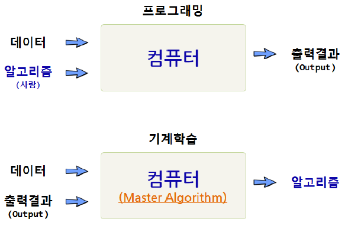
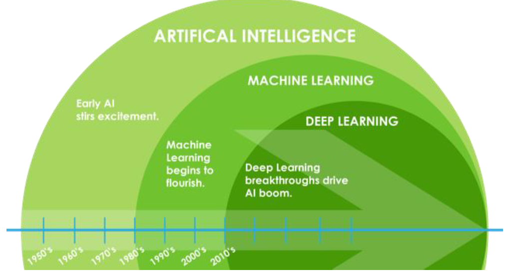
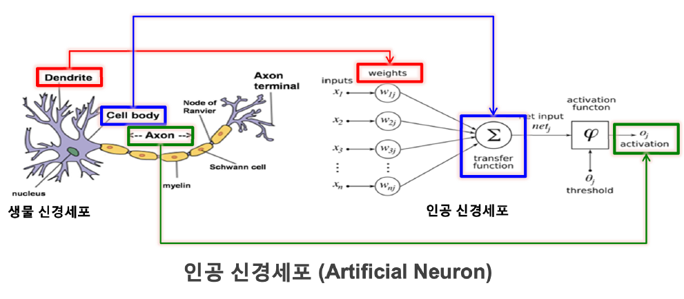
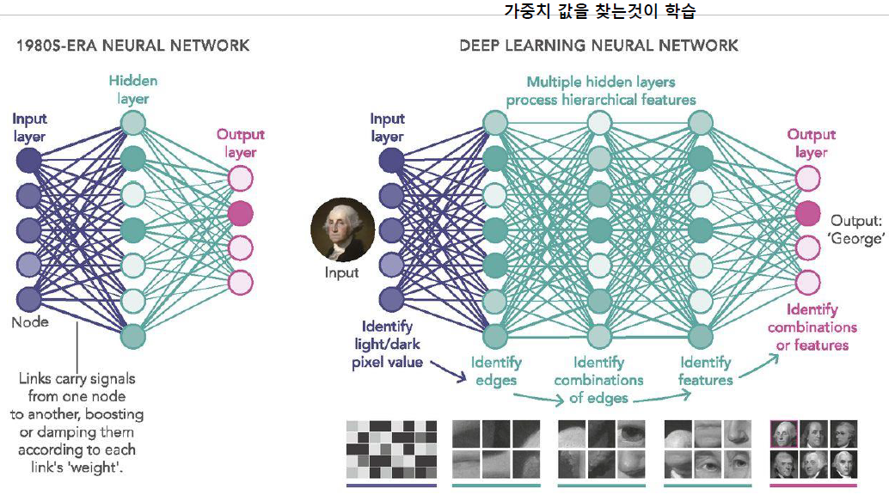
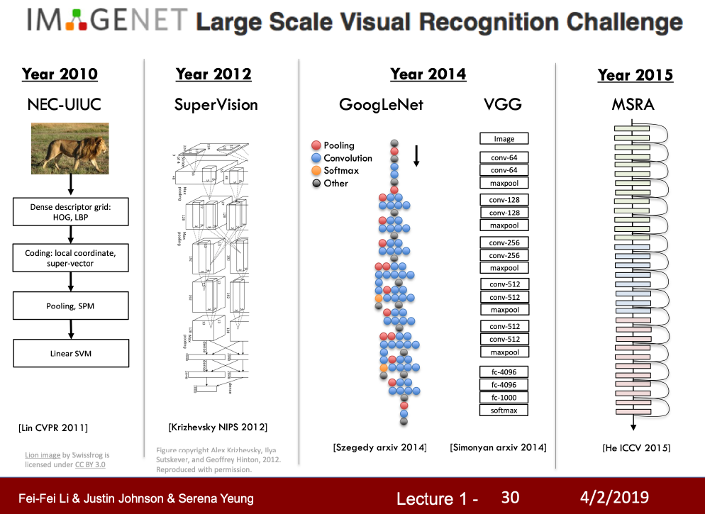

# 인공지능 개요

## 인공지능

- 컴퓨터나 기계를 이용해서 사람처럼 만드는 기술

### 튜링 테스트: 인공지능 성능 측정

- 컴퓨터가 인간처럼 생각할 수 있는지 확인하는 방법
- 정답을 얼마나 맞추냐가 아니라 얼마나 사람과 똑같이 행동하는가에 초점

### 기계학습

Q) 프로그래머가 문제해셜을 위해 직접 만든 프로그램(데이터 처리 규칙) 대신에 컴퓨터가 데이터를 보고 자동으로 규칙을 학습할 수 있는가?

## 딥러닝 개요

### 신경망이란?

- 뇌의 신경세포망에서의 정보처리 원리를 모사한 머신러닝 모델

### 기존 기법과의 차이점
