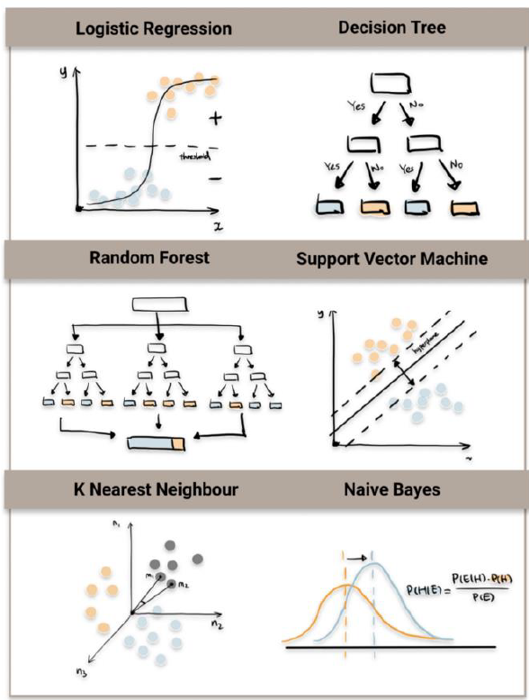
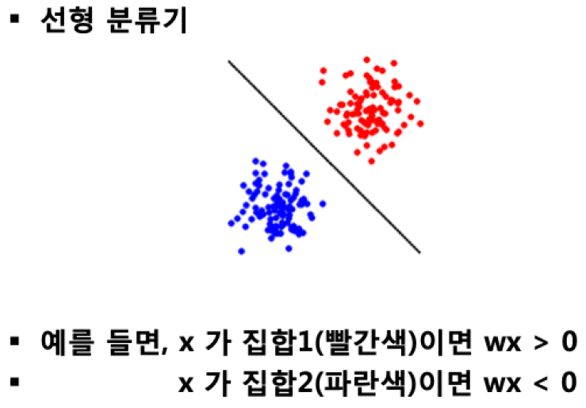
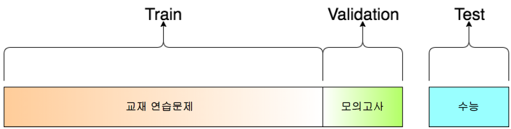

# 학습(Learning)과 모델(Model)

## 기계학습(머신러닝, Machine Learning)

### 모델

- Q) 어떤 분류가 정답인가?
- A) 정답은 없다. 본인이 선택하는 것

- 사용자가 파라메터 수를 결정하는 것이다.

### 학습

- 모델을 결정하는 변수 값을 찾는 과정이다.

## Classification 기법들

### Linear Regression(선형 회귀)

### Support Vector Machine(SVM)

- SVM은 Logistic Regression(LR)과 클래스를 분류한다는데 유사하지만
- LR과 다르게 확률 값을 제공하지 않음

- 최적화를 통해 최대 간극(margin)을 보장

- $H_{2}$, $H_{3}$ 모두 문제를 잘 품
- 어떤게 더 잘 나눈거냐?
- 판단 기준 필요 -> 최대 간극이 제일 넓은게 좋다 = SVM

### k Nearest Neighbor (k-NN)

- k개의 가장 가까운 점들을 찾아서, 해당 점들의 분류결과 평균으로 분류

- 가장 가까운 친구를 찾는 것
- $k=3$이면 자기와 가장 가까운 친구 3명을 봄
- 2명이 초록, 1명이 빨강이면 나는 초록!
- k는 보통 홀수

- k값에 따른 맵을 미리 계산해 놓는다.

### Decision Tree(결정 트리)

- "스무고개" 놀이

- 3가지 속성($a_{1}$, $a_{2}$, $a_{3}$)을 가진 데이터로
- 각 속성은 0, 1로 표현
- 목적 클래스가 +, -로 분류되는 데이터가 있을 경우

### Decision Tree에서 노드 선택

- table을 잘 보고 질문을 잘 하면
- 많이 질문하지 않고 답을 얻어낼 수 있다.
- 따라서 다음에 어떤 질문을 할지 잘 계산해야 한다.

- Information Gain이 큰 질문을 선택해야 한다.

### 모든 데이터는 고차원의 점(point)

- 임의의 데이터는 고차원의 한 점으로 표현 가능

## 모델 선택 및 성능 평가

- 파라메터는 컴퓨터가 알아서 찾아줌
- 내가 할 것은 모델 선택 및 성능 평가

### 모델 선택: Under/Over Fitting

- Underfitting: 모델이 너무 단순한 경우 발생
- Overfitting: 모델이 너무 복잡한 경우 발생

### 모델 성능평가: 데이터셋의 구분

- train set: 모델 학습용 데이터 셋
- validation set: 학습 시 overfitting 등을 체크할 때 사용
- train set: 모델 성능 측정시 사용(학습시 사용되지 않은 데이터 셋)

### 언제까지 학습(최적화)를 해야할까?

### 성능 지표

- $취소율 = TP/(TP+FN)$
- $정밀도 = TP/(TP+FP)$
- $참 긍정률(TPR, True Positive Rate) = TP/(TP+FN)$
- $거짓 긍정률(FPR, False Positive Rate) = FP/(FP+TN)$
